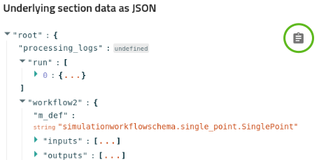

# How to publish data on central NOMAD when there is no parser for your file formats

## Disclaimer
This documentation is not realised by a NOMAD developer and therefore might not reflect the real intent of the NOMAD tool or might not describe the right processes that make NOMAD runs.
This is made by a user (myself) that gathered knowledge through partial, outdated or accurate pages in the official documentation and available tutorials online.
I managed to make things work for my project in some ways and I think it is valuable to share what I understood along the way.

## Introduction
NOMAD offers the possibility to upload files in its database, to parse them automatically to extract relevant information that will be stored in the entries of the database and to use the metadata extracted to help document and search for your data in an efficient way.
To this extent, NOMAD uses so-called parsers that are pieces of Python code to interpret the content of the files.

## Parsing files in NOMAD
When one uploads files on central NOMAD, it will try to open the files and read their content, through an action called _parsing_.

### Parsers and recognised files
On central NOMAD, there is a finite set of parsers available.
One parser is linked to one output of a simulation code (like VASP, FHI-AIMS, ...) or workflow managers (like LOBSTER, FHI-vibes, ...).
When you upload some files on NOMAD, each file will be tested against the list of available parsers to see if the file corresponds to the output of a known code.
If this is the case, the file will be associated to the parser and will be labelled as a _main file_.
The parser will then extract all the information it can from the file and create an entry to store them.
All the unrecognised files are then labelled as _auxiliary files_ and parsers can also look into them to extract additional information.
However, for the upload to be publishable in the database, there must be at least one main file in the upload.
So, having at least a file that is handled by the parsers of NOMAD is mandatory to be able to publish your data on NOMAD.

### Parsers and unrecognised files
So if you upload files and not a single file is recognised by any of the parsers, then no main file is available in the upload.
Following the publication rule above, this upload is therefore not be publishable.

## NOMAD Oasis
### Develop your own database
NOMAD offers the possibility to have your local version of the NOMAD database, a so-called _NOMAD Oasis_.
Such instance of an Oasis can be equiped with designed tools to add new functionalities compared to central NOMAD.
These designed tools are called plugins and are of different sorts: schemas, parsers, normalizers, apps or more (see the documentation [here](https://nomad-lab.eu/prod/v1/staging/docs/howto/plugins/plugins.html))
In our case, we want to publish files that are not recognised by the list of available parsers in the core code of NOMAD, so we would like to develop at least new parsers and most probably to also develop new schemas to store the extracted metadata.

### Developing schemas and parsers plugins
Some documentation is available to develop your own schemas and parsers plugins:
- in the official documentation: https://nomad-lab.eu/prod/v1/staging/docs/howto/plugins/parsers.html
- in tutorial videos on Youtube: https://www.youtube.com/playlist?list=PLrRaxjvn6FDVhfYbSU537bxdKI7oIbIT3

Personally, the tutorial #13 helped me a lot to design my own parsers and integrate them in the Oasis of the project and marked an important milestone in the way an Oasis integrate new pieces of code.
Since the creation of the plugin mechanism, the integration of new functionalities has been eased and is more reliable through time, to my experience
Here is the link to the Github repo for this tutorial and especially to the [part 3](https://github.com/FAIRmat-NFDI/AreaA-Examples/tree/main/tutorial13/part3).

### Plugins in an Oasis stay in an Oasis
Unfortunately, the plugins you develop for your Oasis have little chance to be integrated in the core code of central NOMAD.
Of course, your way of developing plugins might not stick to the standards of the core development team.
Also letting people integrate new stuff in the core code might increase tremendously the codebase and make the whole structure hardly maintainable through time for the same team of developers.
But at least, with your parsers, you can now upload and parse automatically your own files to NOMAD (your Oasis, not the central instance though)!

### Entries in an Oasis stay in an Oasis (at least for now)
Once your plugins are ready, you can upload your files in your Oasis and even publish the uploads, as these files are now recognised by your parsers.
The Oasis is useful to foster collaboration at an institute or project level.
However, when it comes to make your data fully public and accessible to the world in a FAIR way, it becomes a bit restricted.
Indeed, minting a DOI is not possible on an Oasis, unless you link your installation with a DOI provider.
For instance, Datacite might be used to this purpose on your Oasis (https://nomad-lab.eu/prod/v1/docs/reference/config.html#datacite).
Also, for anyone to access your files, you will have to make your Oasis public, which might not be what you want.

An idea would then be to transfer your entries from your Oasis to the central instance.
This "uplink" is also visible at the bottom of an upload (see the image below).
\
\
\
However, even if this is foreseen by the developers, its implementation is not so straightforward and it raises some limitations discussed [here](https://nomad-lab.eu/prod/v1/staging/docs/explanation/oasis.html#current-limitations-and-plans).
So, until that link is developed, the entries in your Oasis will stay in your Oasis and to make your files fully public, it might be time to consider publishing them directly on central NOMAD.

## Publish non recognised files on central NOMAD
As said earlier, NOMAD has already a finite set of parsers available and the list looks like this at the time of writing these lines:
\
\
\
However, this is not the complete list, as it exists some parsers designed for more basic file formats, like JSON or YAML but for these files to be parsed, they must follow the NOMAD conventions, or what I call, the NOMAD language.
The idea is then to store the descriptive information of your unrecognised files in YAML and/or JSON files following the NOMAD language so that they are recognised by NOMAD.
Then, the YAML/JSON files will be the main files of the upload with your scientific files as auxiliary files and you will be able to publish everything on central NOMAD.

Below, we will discuss on how to fill the YAML/JSON files but first, I have to explain the role of the `data` section of an entry in the necessity to have the YAML file in the upload or not.

### The `data` section
Just like the plugins you developed have little chance to be integrated in the codebase of central NOMAD, the way you create your schema might need the use of the `data` section.

Using the [NOMAD Metainfo Browser](https://nomad-lab.eu/prod/v1/gui/analyze/metainfo/nomad.datamodel.datamodel.EntryArchive), one can see that an entry might have specific predefined sections, like `run`, `results`, `workflow2` or `data`.
Each of these sections can be filled during the parsing step but the nature of each of these sections is different.
When one looks at the `results` section, there is a fully defined architecture inside, completely handled by the development team.


The different tools to search for your data in the `Explore > All > Entries` section of NOMAD relies heavily on this `results` section and therefore should suffer no variation through time.
This is why the architecture of the `results` section is modifiable by no one except the development team.
Imagine a user creating a schema with a typo in a metadata name, the search tools will then not be able to locate this entry because of the typo in the name of the metadata.
This rigidity in modification is visible also in other sections, like `run` or `workflow2`.

But what if you need to store an information that is not available in the current state of the available sections, how could you do that?
Well, look into the content of the `data` section, nothing is defined there and so this is where you will be able to store your designed metadata during the parsing of your files!


### Filling the `data` section
As the `data` section doesn't have a predefined structure, the writer of the plugin that needs a designed metadata structure will have to write this metadata structure, the so-called metadata schema.
In your plugin development, you will then need to create a schema package.
You can find a documentation [page](https://nomad-lab.eu/prod/v1/staging/docs/howto/plugins/schema_packages.html) about this.

> #### Personal opinion here
> The documentation might be outdated and confusing when it comes to real development.
> I would suggest to read its content for information and follow the tutorials mentioned above when it comes to actually coding the schema in Python.

> #### Be careful
> Filling the `data` section with your own metadata won't mean that you will be able to later search for your entries with these metadata.
> Obviously, NOMAD is not really aware of what you will input so the search tools already designed are not relying on what they don't know, here the content of the `data` section.
> So be careful when you create your schema to not store only in the `data` section something that can be already handled by an other section.


<!-- However, when it will be time to publish on central NOMAD, it won't be aware of the fact that your plugin have defined a schema for the `data` section and so when you will upload your JSON file with content in the `data` section, the content will not show up in the entry created in central NOMAD. -->
<!-- You then need to provide NOMAD a file that describes the metadata schema, unfortunately Python files and therefore, Python schema files are not recognised by NOMAD. -->


### Data in JSON files
As we will see later, exporting a NOMAD entry is done through JSON, so we will use a JSON file to store the data we want to extract from the unrecognised files.
Writing the JSON file can be done manually 


<!-- The idea for NOMAD to recognise the scientific files is to "convert" them into a known format, so why not in JSON (this is not my choice but rather the one of the documentation, that writes data information in JSON).
But writing JSON files is not really fun and as you have already written your plugins, it becomes unneccessary. -->

### Parse in your Oasis, publish on central NOMAD
When you create an entry in NOMAD, you can navigate through the extracted metadata in the "Data" tab of the entry (see the screenshot below).

Here, you can export each section (each column) in a JSON file by clicking on the "<>" button of the section (see the screenshot below).

A visualisation of the JSON content might show up and by clicking on the clipboard icon (see the screenshot below), you can copy the content and save it in a dedicated JSON file.


If you want to export all the entry, export the content of the entry at the first column "Entry" level.
However, this JSON will contain the "metadata" section that is related to the upload on your Oasis, so you delete this section from the content.
Now, you have a JSON file that contains the data structured in a way understandable for NOMAD, central or Oasis. \
**Important point**: For NOMAD to recognise your JSON file as JSON containing data to create en entry, the name of the JSON is to be written as `<json-name>.archive.json`.
Go to central NOMAD, upload your JSON file and you might see the entry successfully created and filled!

#### Or maybe not
Depending on the schema you used in your parser, the final content of the entry on central NOMAD might lack some information, especially if the `data` section is involved.

### Schemas in YAML files
When you developed the plugins in your Oasis, at some point, you might have written a Python schema file to store metadata in the `data` section.
It is also possible to write the same schema in a YAML file.
The advantage of YAML over Python is that NOMAD can parse a YAML file and understands its content if it is written correctly.
There is a package (https://github.com/hampusnasstrom/metainfo-yaml2py) that allows one to convert a YAML schema file into a Python schema file.
Quite useful but this is doing the opposite conversion we want...
Unfortunately, I didn't find a way to convert a schema from a Python file to a YAML file, so we will need to write this by hand!
Some documentation is available to assist you in this task:https://nomad-lab.eu/prod/v1/staging/docs/howto/customization/basics.html
**Important info**: For NOMAD to recognise your YAML schema file as is, the name of the file is to be structured like this: `<schema_name>.archive/yaml`.

>#### Personal opinion here
>For what I did up to now when writing Python schemas, the conversion to YAML is not that hard but a bit time consuming and the documentation given above might be a bit misleading in the examples given sometimes.
>It took me several interations to make the things work correctly unfortunately...

### Publishing on central NOMAD
To publish a non-recognised file on central NOMAD where the `data` section needs to be used, you now have to have two files in addition to your scientific files:
- The JSON file produced in the same way as described above
- The YAML schema file

However, a final step is to be done here: linking the JSON to the YAML file.

#### Linking the JSON and the YAML files
When you export the JSON file from the entry in your Oasis, you might in the `data` section a metadata called `m_def`.
This metadata should point to the definition of the section in the schema file that define the structure.
As the link is made inside the plugin, the value should look something like this:
```"m_def": "<plugin_name>.schema_packages.<name_of_schema_file>"```
But when we will upload these two files in central NOMAD, NOMAD won't know this link.
So, we have to modify the `m_def` value and indicate to NOMAD where it should find the right section definition.
This [section](https://nomad-lab.eu/prod/v1/staging/docs/howto/customization/basics.html#different-forms-of-references) in the documention shows how to reference a section from several locations.
Here, we are interested in a section located in a separate file in the same upload or in a file in a separate upload.

So for example, let's assume that we have a non-recognised file where we want to store information in the `data` section of the entry.
Then we need three files:
- the unrecognised file: unrecog.txt
- a YAML file: unrecog_schema.archive.yaml
- a JSON file: unrecog_data.archive.json

Let's assume `unrecog.txt` is something like:
```
# WELCOME IN THE OUTPUT FILE FROM AN EXPERIMENT
important_information: 42
important_date: "2025-05-16T12:00:00"
unused_data: 13
```

Here, we would like to parse only the `important` metadata from the `unrecog.txt` file.
The content of the YAML file should be something like:
```
definitions:
  sections:
    ImportantSection:
      quantities:
        information:
          type: int
          description: The important information of our experiment
        date:
          type: str
          description: The date of our experiment
```

And the parsing of the file should produce a JSON file that looks like this:
```
{
  "data": {
    "m_def": "unrecog_parser.schema_packages.unrecog_schema#ImportantSection",
    "information": 42,
    "date": "2025-05-16T12:00:00"
  }
}
```

Using the `m_def` metadata of the JSON file, one can understand that the plugin name is `unrecog_parser` and that the schema file is name `unrecog_schema`.
However, central NOMAD doesn't know about this `unrecog_parser` or the `unrecog_schema`, so we need to help NOMAD to understand what is the good section definition here.
As the three files are uploaded in the same upload, we will use the `../upload/raw` solution from the documentation to point to the good schema.
```
{
  "data": {
    "m_def": "../upload/raw/unrecog_schema.archive.yaml#ImportantSection",
    "information": 42,
    "date": "2025-05-16T12:00:00"
  }
}
```

Now, NOMAD knows that it has to create an entry based on the JSON file, following the section `ImportantSection` in the YAML schema file.