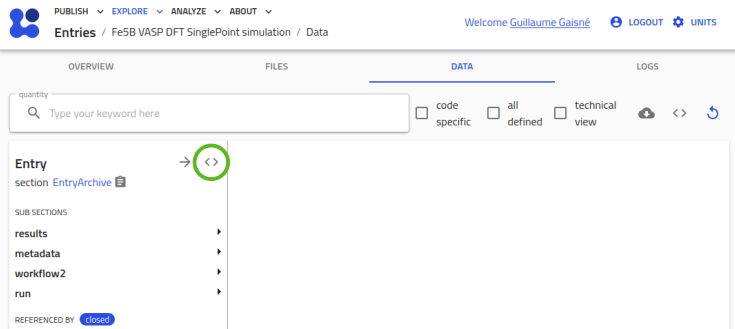

# Publish data on central NOMAD if there is no parser for your file formats

## Introduction
NOMAD offers the possibility to upload files in the database and to parse them automatically to extract relevant information that will be stored in the entries of the database and use the metadata extracted to help document and search for your data in an efficient way.
To this extent, NOMAD uses so-called parsers that are pieces of Python code to interpret the content of the files.

## Parsing files in NOMAD
When one uploads files on central NOMAD, it will try to open the files and read their content.

### Parsers and recognised files
On central NOMAD, only a finite set of parsers are available.
So when you upload some files, the list of parsers will be tested against the files and a parser might recognise one of the files and extract its content.
In this case, that recognised file is labelled as a main file.
For NOMAD to create an entry in the database, one upload has to have at least one main file.
In such situation, all the other files in the upload become auxiliary files that might be opened and looked in for during the parsing of the main file, to extract additionnal information.

### Parsers and unrecognised files
But if you upload files that are not recognised by any of the parsers, then no main file is available in the upload.
Following the publication rule above, this upload might not be publishable without at least one main file.

## NOMAD Oasis
### To develop your own database
NOMAD offers the possibility to have your local version of the NOMAD database, a so-called NOMAD Oasis.
Such instance of an Oasis can be equiped with designed tools to add new functionalities compared to central NOMAD.
These desgined tools are called plugins and are of different sorts: schemas, parsers, normalizers, apps or more (see https://nomad-lab.eu/prod/v1/staging/docs/howto/plugins/plugins.html)
In our case, we want to publish files that are not recognised by central NOMAD, so we would like to develop at least new parsers with the related new schemas.

### Developing schemas and parsers plugins
Some documentation is available to develop your own schemas and parsers plugins:
- in the official documentation: https://nomad-lab.eu/prod/v1/staging/docs/howto/plugins/parsers.html
- in tutorial videos on Youtube: https://www.youtube.com/playlist?list=PLrRaxjvn6FDVhfYbSU537bxdKI7oIbIT3

Personally, the tutorial #13 helped me a lot to design my own parsers and integrate them in my Oasis.
Here is the link to the Github repo for this tutorial and especially to the part 3: https://github.com/FAIRmat-NFDI/AreaA-Examples/tree/main/tutorial13/part3.

### Plugins in an Oasis stay in an Oasis
Unfortunately, the plugins you develop for your Oasis have little chance to be integrated in the core code of central NOMAD.
Of course, your way of developing plugins might not stick to the standards of the core development team and also letting people integrate new stuff in the core code might increase tremendously the codebase and make the whole structure hardly maintainable through time for the developers team.
But at least, with your parsers, you can now upload your own files to NOMAD (your Oasis, not the central instance though)!

### Entries in an Oasis stay in an Oasis (at least for now)
At that point, you managed to design your own plugins to integrate new file formats in your Oasis, you published your datasets on your Oasis to share them with your co-authors and are writing the last words in the article that describes your last weeks or months of hard work.
Along with the publication of your article, you conscientiously want to upload the data used in a FAIR way and with a DOI. Yay!
But when it comes to minting a DOI on your datasets on your Oasis, it blocks and you ask yourself how researchers from other institutes might be able to see your data located on your private Oasis...
So you decide it is time to publish your files directly on central, as it is public and allow to mint DOI and you remember that when you uploaded your entries on your Oasis, there was an option to publish afterwards your upload directly on central NOMAD. Yay!
Well, you might see that this link is not working properly.
Indeed, this functionality is not yet coded by the developers and this for several reasons, discussed here: https://nomad-lab.eu/prod/v1/staging/docs/explanation/oasis.html#current-limitations-and-plans.
So, this might be possible to do that in the future but not for now, and I assumed this is why you are reading this document.

## Publish non recognised files on central NOMAD
In the list of parsers available in the core functionalities of NOMAD, some are designed to be able to read YAML or JSON files, and that is what we will use here, to be able to publish non recognised files formats on central NOMAD.

### Data in JSON files
The idea for NOMAD to recognise the scientific files is to "convert" them into a known format, so why not in JSON (this is not my choice but rather the one of the documentation, that writes data information in JSON).
But writing JSON files is not really fun and as you have already written your plugins, it becomes unneccessary.

### Parse in your Oasis, publish on central NOMAD
When you create an entry in NOMAD, you can navigate through the extracted metadata in the "Data" tab of the entry (see the screenshot below).

Here, you can export each section (each column) in a JSON file by clicking on the "<>" button of the section (see the screenshot below).

A visualisation of the JSON content might show up and by clicking on the clipboard icon (see the screenshot below), you can copy the content and save it in a dedicated JSON file.


If you want to export all the entry, export the content of the entry at the first column "Entry" level.
However, this JSON will contain the "metadata" section that is related to the upload on your Oasis, so you delete this section from the content.
Now, you have a JSON file that contains the data structured in a way understandable for NOMAD, central or Oasis. \
**Important point**: For NOMAD to recognise your JSON file as JSON containing data to create en entry, the name of the JSON is to be written as `<json-name>.archive.json`.
Go to central NOMAD, upload your JSON file and you might see the entry successfully created and filled!

#### Or maybe not
Depending on the schema you used in your parser, the final content of the entry on central NOMAD might lack some information, especially if the `data` section is involved.

### The `data` section
Just like the plugins you developed have little chance to be integrated in the codebase of central NOMAD, the way you create your schema might need the use of the `data` section.
Using the NOMAD Metainfo Browser (https://nomad-lab.eu/prod/v1/gui/analyze/metainfo/nomad.datamodel.datamodel.EntryArchive), one can see that an entry might have specific predefined sections, like `run`, `results`, `workflow2` or `data`.
Each of these sections can be filled during the parsing step but the nature of each of these sections is different.
When one looks at the `results` section, there is a fully defined architecture inside, completely handled by the development team.
The different tools to search for your data in the `Explore > All > Entries` section of NOMAD relies heavily on this `results` section and therefore should suffer no variation through time.
This is why the content of the `results` is modifiable by no one except the development team, imagine a user creating a schema with a typo in a metadata name, the search tools will then not be able to locate this entry because of the typo in the name of the metadata.
This rigidity in modification is visible also in other sections, like `run` or `workflow2`.
But what if you need to store an information that is not available in the current state of the available sections, how could you do that?
Well, look into the content of the `data` section, nothing is defined there and so this is where you will be able to store your designed metadata during the parsing of your files!

#### Be careful
Filling the `data` section with your own metadata won't mean that you will be able to later search your entries with these metadata.
Obviously, NOMAD is not really aware of what you will input so the search tools already designed are not relying on what they don't know, here the content of the `data` section.

### Filling the `data` section
As the `data` section doesn't have a predefined structure, the writer of the plugin that needs designed metadata will have to write this metadata structure, the so-called metadata schema.
In your plugin development, you will then need to create a schema package.
You can find a documentation page about this: https://nomad-lab.eu/prod/v1/staging/docs/howto/plugins/schema_packages.html

>#### Personal opinion here
>The documentation might be outdated and confusing when it comes to real development.
>I would suggest to read its content for information and follow the tutorials mentioned above when it comes to actually coding the schema in Python.

However, when it will be time to publish on central NOMAD, it won't be aware of the fact that your plugin have defined a schema for the `data` section and so when you will upload your JSON file with content in the `data` section, the content will not show up in the entry created in central NOMAD.
You then need to provide NOMAD a file that describes the metadata schema, unfortunately Python files and therefore, Python schema files are not recognised by NOMAD.

### Schemas in YAML files
When you developed the plugins in your Oasis, at some point, you might have written a Python schema file to store metadata in the `data` section.
It is also possible to write the same schema in a YAML file.
The advantage of YAML over Python is that NOMAD can parse a YAML file and understands its content if it is written correctly.
There is a package (https://github.com/hampusnasstrom/metainfo-yaml2py) that allows one to convert a YAML schema file into a Python schema file.
Quite useful but this is doing the opposite conversion we want...
Unfortunately, I didn't find a way to convert a schema from a Python file to a YAML file, so we will need to write this by hand!
Some documentation is available to assist you in this task:https://nomad-lab.eu/prod/v1/staging/docs/howto/customization/basics.html
**Important info**: For NOMAD to recognise your YAML schema file as is, the name of the file is to be structured like this: `<schema_name>.archive/yaml`.

>#### Personal opinion here
>For what I did up to now when writing Python schemas, the conversion to YAML is not that hard but a bit time consuming and the documentation given above might be a bit misleading in the examples given sometimes.
>It took me several interations to make the things work correctly unfortunately...

### Publishing on central NOMAD
To publish a non-recognised file on central NOMAD where the `data` section needs to be used, you now have to have two files in addition to your scientific files:
- The JSON file produced in the same way as described above
- The YAML schema file

However, a final step is to be done here: linking the JSON to the YAML file.

#### Linking the JSON and the YAML files
When you export the JSON file from the entry in your Oasis, you might in the `data` section a metadata called `m_def`.
This metadata should point to the definition of the section in the schema file that define the structure.
As the link is made inside the plugin, the value should look something like this:
```"m_def": "<plugin_name>.schema_packages.<name_of_schema_file>"```
But when we will upload these two files in central NOMAD, NOMAD won't know this link.
So, we have to modify the `m_def` value and indicate to NOMAD where it should find the right section definition.
This [section](https://nomad-lab.eu/prod/v1/staging/docs/howto/customization/basics.html#different-forms-of-references) in the documention shows how to reference a section from several locations.
Here, we are interested in a section located in a separate file in the same upload or in a file in a separate upload.

So for example, let's assume that we have a non-recognised file where we want to store information in the `data` section of the entry.
Then we need three files:
- the unrecognised file: unrecog.txt
- a YAML file: unrecog_schema.archive.yaml
- a JSON file: unrecog_data.archive.json

Let's assume `unrecog.txt` is something like:
```
# WELCOME IN THE OUTPUT FILE FROM AN EXPERIMENT
important_information: 42
important_date: "2025-05-16T12:00:00"
unused_data: 13
```

Here, we would like to parse only the `important` metadata from the `unrecog.txt` file.
The content of the YAML file should be something like:
```
definitions:
  sections:
    ImportantSection:
      quantities:
        information:
          type: int
          description: The important information of our experiment
        date:
          type: str
          description: The date of our experiment
```

And the parsing of the file should produce a JSON file that looks like this:
```
{
  "data": {
    "m_def": "unrecog_parser.schema_packages.unrecog_schema#ImportantSection",
    "information": 42,
    "date": "2025-05-16T12:00:00"
  }
}
```

Using the `m_def` metadata of the JSON file, one can understand that the plugin name is `unrecog_parser` and that the schema file is name `unrecog_schema`.
However, central NOMAD doesn't know about this `unrecog_parser` or the `unrecog_schema`, so we need to help NOMAD to understand what is the good section definition here.
As the three files are uploaded in the same upload, we will use the `../upload/raw` solution from the documentation to point to the good schema.
```
{
  "data": {
    "m_def": "../upload/raw/unrecog_schema.archive.yaml#ImportantSection",
    "information": 42,
    "date": "2025-05-16T12:00:00"
  }
}
```

Now, NOMAD knows that it has to create an entry based on the JSON file, following the section `ImportantSection` in the YAML schema file.