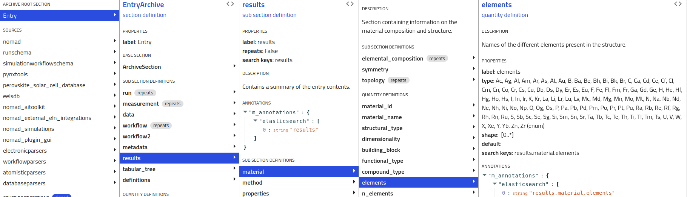

# Practical documentation to publish unrecognised files on central NOMAD

This is the practical documentation with the steps to publish your unrecognised data on central NOMAD for different scenarios.
Here are only listed the steps to publish, for explanations about this whole process, please go the `Long documentation` folder.

This documentation is split into different cases to distinguish if the `data` section is used or not in the final entry in NOMAD and if there is an available parser plugin installed on the Oasis or not.

## The `data` section is not filled
This is the simplest case, where only a JSON file alone can contain all the information necessary to create the entry in central NOMAD.
See for instance the example file `unrecog_data_no_data_section.archive.json`.

### A parser plugin is available on the Oasis
- Access the Oasis and upload your scientific file
- Once the file is parsed, go to the Data section of the entry \

- Export the full entry in JSON by using the `<>` button at the top of the 'Entry' column \

- Copy the JSON content \

- Paste the content into a text editor and save the file with the extension `.archive.json`
- Upload this JSON archive into central NOMAD

<a id="json-handwriting"></a>
### No parser plugin is available
In this case, the JSON archive file has to be written by hand.
The use of the [NOMAD Metainfo Browser](https://nomad-lab.eu/prod/v1/gui/analyze/metainfo/nomad.datamodel.datamodel.EntryArchive) might be really useful in that case.
By browsing the different sections, one can repeat the same structure within the JSON file.
For instance, if one wants to fill the elemental composition of the sample studied (let's say it is H2O), according to the NOMAD Metainfo Browser, this can be filled in the following quantity `Entry > results > material > elements`.\

The corresponding content in the JSON archive file should then be:
```
{
    "results": {
        "material": {
            "elements": ["H", "O"]
        }
    }
}
```
> Note that there is no `Entry` level in the JSON.

Go on with the rest of the metadata you have to write in the JSON.
However, for big JSON files, the time spent writing the files by hand could better be invested in writing a parser plugin that can do that automatically.

## The `data` section is filled
This case requires the use of a separate schema file to describe the structure of the metadata storage in the `data` section.

### A parser plugin is available on the Oasis

#### The YAML archive file
The parser plugin should have a Python file describing the schema of the `data` section.
This schema should be translated into a YAML file.
Documentation about YAML schema files can be found [here](https://nomad-lab.eu/prod/v1/staging/docs/howto/customization/basics.html).

For instance, if your Python schema has this structure:
```
class ImportantSubsection(MSection):
    important_date = Quantity(type=str, description="The date of the experiment")

class ImportantSchema(Schema):
    important_information = Quantity(type=int, description="The important information of our experiment)
    important_subsection = SubSection(sub_section=ImportantSubsection.m_def, repeats=False)
```
The translated YAML file should then be:
```
definitions:
  sections:
    ImportantSubsection:
      quantities:
        important_date:
          type: str
          description: The date of the experiment
    ImportantSchema:
      quantities:
        important_information:
          type: int
          description: The important information of our experiment
      sub_sections:
        important_subsection:
          section: ImportantSubsection
          repeats: false
```
Just like the JSON archive file, the YAML schema file should have `archive.yaml` as extension in the name of the file.

#### The JSON archive file
The content of the JSON file should be written using the same logic as the section [above](#json-handwriting), except this time, instead of using the NOMAD Metainfo Browser, one should use the schema file.
In this case, the `data` section of the JSON archive could look something like this:
```
{
  "data": {
    "important_information": 42,
    "important_subsection": {
      "important_date": "2025-05-16T12:00:00"
    }
  },
  {... other sections}
}
```

#### Linking the JSON archive to the YAML schema
For NOMAD to understand that the structure of the `data` section in the JSON corresponds to the schema written in the YAML file, one has to specify this in the `m_def` metadata of the `data` section in the JSON file.
This link is called a *reference* and can be done in several ways, described [here](https://nomad-lab.eu/prod/v1/staging/docs/howto/customization/basics.html#different-forms-of-references).
In this case, we will use the references to other files in the same upload or in a different upload, with the references beggining with `../upload`.
For this example, we will assume that the JSON and YAML files will be in the same upload.
In this case, the `data` section of the JSON archive should be like this:
```
{
  "data": {
    "m_def": "../upload/raw/unrecog_schema.archive.yaml#ImportantSchema",
    "important_information": 42,
    "important_subsection": {
      "important_date": "2025-05-16T12:00:00"
    }
  },
  {... other sections}
}
```
> Note: In that case, the name of the schema file is `unrecog_schema.archive.yaml`.
> Note: The YAML schema, being parsed by NOMAD, will create its own entry in the database, only describing the content of the schema. So in this case, by uploading, the JSON and the YAML files, two entries will be produced in the database.

### No parser plugin is available
This is the scenario where both YAML and JSON files have to be written by hand.
In this case, the [documentation](https://nomad-lab.eu/prod/v1/staging/docs/howto/customization/basics.html) to write YAML schema files will be helpful and see the section [above](#json-handwriting) to write the content in the JSON file and don't forget to add the `m_def` metadata to link the YAML and JSON files.